# Báo cáo cuối kỳ Data Mining: BalanceCascade cho dữ liệu mất cân bằng

**Đề tài:** Ứng dụng BalanceCascade trong bài toán phân loại mất cân bằng
**Dataset chính:** Give Me Some Credit
**Target:** `SeriousDlqin2yrs`
**Thuật toán trọng tâm:** BalanceCascade

## Tóm tắt

Báo cáo này nghiên cứu BalanceCascade trong bài toán phân loại nhị phân có mất cân bằng lớp. Dataset chính là Give Me Some Credit, một bài toán credit-risk từ Kaggle. Target `SeriousDlqin2yrs` cho biết khách hàng có gặp tình trạng quá hạn nghiêm trọng trong vòng 2 năm hay không. Trong dữ liệu training, class `1` chỉ chiếm 6.7%, nên accuracy không phù hợp để đánh giá mô hình.

Pipeline thực nghiệm gồm bốn phần. Phần đầu trình bày cơ sở lý thuyết về class imbalance và BalanceCascade. Phần thứ hai EDA và tiền xử lý Give Me Some Credit, có kiểm soát leakage bằng stratified train, validation, test split. Phần kết quả đi theo mạch: case thuận lợi có kiểm soát, case khó/giới hạn, rồi dataset thật Give Me Some Credit. Phần cuối bổ sung so sánh mô hình, threshold tuning và kiểm tra độ ổn định theo seed.

Kết quả cho thấy trong case thuận lợi `ideal_separable`, BalanceCascade tuned bắt được lớp thiểu số tốt với recall = 0.908, nhưng precision chỉ đạt 0.250. Trên dataset thật Give Me Some Credit, BalanceCascade tuned hợp lý hơn bản simple, đạt precision = 0.226, recall = 0.682 và F2 = 0.486 tại threshold 0.50. Khi chọn threshold trên validation, BalanceCascade tuned đạt F2 = 0.493 trên test. Ở case khó `weak_overlap` và cấu hình BalanceCascade simple, thuật toán dễ báo positive quá rộng: recall cao nhưng precision rất thấp. Vì vậy, kết luận đúng không phải là BalanceCascade thắng tuyệt đối, mà là BalanceCascade có ích cho sàng lọc rủi ro nếu cấu hình và threshold được kiểm soát.

# CHƯƠNG 1. TỔNG QUAN NGHIÊN CỨU

## 1.1. Bối cảnh nghiên cứu

Phân loại là một bài toán phổ biến trong khai phá dữ liệu. Từ dữ liệu lịch sử có nhãn, mô hình học cách dự đoán nhãn cho quan sát mới. Trong các bài toán thực tế, nhãn thường không cân bằng. Ví dụ, số giao dịch gian lận ít hơn giao dịch bình thường, số máy lỗi ít hơn máy hoạt động bình thường, số khách hàng rủi ro ít hơn khách hàng trả nợ tốt.

Với dữ liệu cân bằng, accuracy có thể là một metric dễ hiểu. Nhưng khi dữ liệu mất cân bằng, accuracy có thể tạo cảm giác mô hình tốt trong khi mô hình bỏ sót hầu hết lớp quan trọng.

Trong class imbalance, một lớp chiếm đa số gọi là majority class, lớp còn lại ít hơn gọi là minority class. Minority class thường là lớp cần quan tâm hơn. Trong bài toán credit-risk, class `1` là nhóm khách hàng có serious delinquency trong 2 năm. Nhóm này ít hơn nhiều, nhưng lại có ý nghĩa nghiệp vụ lớn.

Nếu một mô hình luôn dự đoán class `0`, nó có thể đạt accuracy khoảng 93.3% trên Give Me Some Credit. Nhưng recall của class `1` sẽ bằng 0. Mô hình như vậy không có giá trị nếu mục tiêu là phát hiện khách hàng rủi ro.

Give Me Some Credit yêu cầu dự đoán xác suất một người gặp financial distress trong hai năm tiếp theo. Trong bài này, nhóm có lúc gọi class `1` là nhóm rủi ro để dễ trình bày, nhưng ý nghĩa chính xác của target vẫn là serious delinquency trong vòng 2 năm.

Mục tiêu thực tế không phải tự động từ chối khoản vay. Với độ chính xác của bài cuối kỳ, cách hiểu hợp lý hơn là sàng lọc rủi ro: mô hình tạo danh sách khách hàng cần kiểm tra kỹ hơn. Khi dùng theo hướng sàng lọc, recall quan trọng, nhưng precision vẫn phải đủ để không tạo quá nhiều cảnh báo nhầm.

## 1.2. Động lực nghiên cứu

BalanceCascade được chọn vì đây là một phương pháp ensemble undersampling có cơ chế rõ ràng. Random undersampling có thể làm mất nhiều majority samples. EasyEnsemble xử lý bằng cách lấy nhiều subset majority độc lập. BalanceCascade đi thêm một bước: train theo nhiều stage và loại dần các majority samples đã được phân loại đúng, để stage sau tập trung hơn vào các điểm khó.

Cơ chế này đủ trực quan để giải thích, nhưng cũng đủ có rủi ro để phân tích. Nếu cascade quá mạnh, mô hình có thể tăng recall bằng cách gắn quá nhiều điểm là positive. Vì vậy, bài này không chỉ nhìn F2, mà đọc cùng precision, recall, PR-AUC, confusion matrix và threshold.

## 1.3. Mục tiêu nghiên cứu

Bài nghiên cứu có bốn mục tiêu:

1. Trình bày bài toán class imbalance và lý do accuracy không đủ.
2. Cài đặt BalanceCascade ở mức đơn giản, dễ giải thích.
3. So sánh BalanceCascade với các mô hình đối chiếu hợp lý trên Give Me Some Credit.
4. Phân tích trade-off giữa precision và recall để đưa ra kết luận thận trọng.

## 1.4. Phạm vi nghiên cứu

Phạm vi bài được giới hạn như sau:

- Dataset chính là Give Me Some Credit, dùng file `cs-training.csv`.
- Target là `SeriousDlqin2yrs`, positive class là `1`.
- Không dùng `cs-test.csv` để đánh giá vì file này không có nhãn target.
- Các mô hình so sánh gồm Logistic Regression balanced, RandomForest balanced, EasyEnsemble simple, BalanceCascade simple và BalanceCascade tuned.
- Threshold được chọn trên validation set, sau đó mới đánh giá lại trên test set.

# CHƯƠNG 2. CƠ SỞ LÝ THUYẾT

## 2.1. Bài toán class imbalance

### 2.1.1. Majority class và minority class

Trong binary classification, mỗi quan sát \(x_i\) có nhãn \(y_i \in \{0,1\}\). Mô hình học từ dữ liệu đã có nhãn để dự đoán xác suất hoặc nhãn cho quan sát mới. Với bài này, \(y=1\) là class cần quan tâm hơn vì nó biểu diễn khách hàng có serious delinquency trong 2 năm.

Trong dữ liệu mất cân bằng, ta có:

- Majority class: lớp có nhiều quan sát hơn.
- Minority class: lớp có ít quan sát hơn.

Với Give Me Some Credit:

| Class | Diễn giải | Số dòng | Tỷ lệ |
|---:|---|---:|---:|
| 0 | Không có serious delinquency trong 2 năm | 139,974 | 93.3% |
| 1 | Có serious delinquency trong 2 năm | 10,026 | 6.7% |

Class `1` là minority class. Đây cũng là positive class trong bài.

Tỷ lệ positive chỉ 6.7% nghĩa là nếu chọn ngẫu nhiên 100 khách hàng, trung bình chỉ khoảng 7 người thuộc class `1`. Vì vậy, mô hình phải làm tốt hơn chọn ngẫu nhiên thì mới có ý nghĩa cho sàng lọc rủi ro.

### 2.1.2. Vì sao accuracy dễ gây hiểu lầm

Để hiểu metric, trước hết cần đọc confusion matrix:

| Ký hiệu | Ý nghĩa |
|---|---|
| TP | Dự đoán `1` và thực tế là `1` |
| FP | Dự đoán `1` nhưng thực tế là `0` |
| FN | Dự đoán `0` nhưng thực tế là `1` |
| TN | Dự đoán `0` và thực tế là `0` |

Accuracy được tính bằng:

$$
\text{Accuracy}=\frac{TP+TN}{TP+FP+FN+TN}
$$

Tử số \(TP+TN\) là số dự đoán đúng, mẫu số là tổng số quan sát. Công thức này hợp lý khi hai lớp tương đối cân bằng và chi phí hai loại lỗi gần nhau. Nhưng trong dữ liệu mất cân bằng, \(TN\) thường rất lớn. Nếu chỉ nhìn accuracy, mô hình có thể tốt nhờ dự đoán đúng majority class nhưng bỏ sót minority class.

Với Give Me Some Credit, nếu mô hình luôn dự đoán class `0`, nó đúng với toàn bộ 139,974 khách hàng class `0` và sai với 10,026 khách hàng class `1`. Accuracy xấp xỉ:

$$
\frac{139974}{150000} \approx 0.933
$$

Con số 93.3% nhìn cao, nhưng mô hình không phát hiện được khách hàng rủi ro nào:

$$
\text{Recall}_{\text{class 1}} = 0
$$

Kết quả đó không phù hợp với mục tiêu phát hiện nhóm class `1`.

### 2.1.3. Precision, recall, F1 và F2

Precision trả lời câu hỏi: trong các khách hàng bị mô hình gắn nhãn rủi ro, bao nhiêu người thật sự thuộc class `1`?

$$
\text{Precision}=\frac{TP}{TP+FP}
$$

Mẫu số \(TP+FP\) là tổng số khách hàng bị cảnh báo. Nếu precision thấp, danh sách cảnh báo có nhiều khách hàng không rủi ro. Trong credit-risk, điều này làm tăng chi phí review và có thể ảnh hưởng trải nghiệm khách hàng.

Recall trả lời câu hỏi: trong các khách hàng thật sự thuộc class `1`, mô hình phát hiện được bao nhiêu người?

$$
\text{Recall}=\frac{TP}{TP+FN}
$$

Mẫu số \(TP+FN\) là tổng số khách hàng rủi ro thật. Nếu recall thấp, mô hình bỏ sót nhiều khách hàng cần được kiểm tra kỹ hơn. Với mục tiêu sàng lọc, recall thường được ưu tiên hơn accuracy.

F1 cân bằng precision và recall:

$$
F_1=\frac{2 \cdot P \cdot R}{P+R}
$$

Trong đó, \(P\) là precision và \(R\) là recall. F1 là trung bình điều hòa, nên nếu một trong hai giá trị rất thấp thì F1 cũng thấp. F1 không cho một metric cao chỉ vì precision cao nhưng recall gần 0, hoặc ngược lại.

Công thức tổng quát của \(F_\beta\) là:

$$
F_\beta=\frac{(1+\beta^2)\cdot P \cdot R}{\beta^2 \cdot P+R}
$$

Khi \(\beta=1\), ta có F1. Khi \(\beta=2\), recall được nhấn mạnh hơn precision:

$$
F_2=\frac{(1+2^2)\cdot P \cdot R}{2^2 \cdot P+R}
$$

Bài này ưu tiên F2 vì mục tiêu sàng lọc quan tâm đến việc giảm bỏ sót khách hàng thuộc class `1`. Tuy nhiên, F2 không được đọc một mình. Nếu precision quá thấp, mô hình vẫn khó dùng vì tạo quá nhiều false positives.

Ngoài các metric tại một threshold cụ thể, bài còn dùng ROC-AUC và PR-AUC. ROC-AUC đo khả năng xếp hạng positive cao hơn negative trên nhiều threshold. PR-AUC tập trung vào quan hệ precision-recall của positive class. Với dữ liệu mất cân bằng, PR-AUC thường phản ánh cảm giác vận hành tốt hơn vì nó không bị số lượng true negatives lớn làm kết quả nhìn quá đẹp.

## 2.2. Các hướng xử lý dữ liệu mất cân bằng

Class weighting điều chỉnh trọng số lỗi theo tần suất lớp. Với `class_weight="balanced"`, scikit-learn tính trọng số ngược với tần suất lớp theo công thức dạng:

$$
\text{weight}_c=\frac{n_{\text{samples}}}{n_{\text{classes}}\cdot n_c}
$$

Trong công thức trên, \(n_{\text{samples}}\) là tổng số dòng, \(n_{\text{classes}}\) là số lớp, còn \(n_c\) là số dòng của lớp \(c\). Nếu lớp \(c\) ít mẫu, \(n_c\) nhỏ, nên \(\text{weight}_c\) lớn hơn. Nhờ vậy, lỗi trên minority class bị phạt nặng hơn trong quá trình học.

Trong bài, Logistic Regression balanced và RandomForest balanced là hai mô hình đối chiếu dùng hướng này. Với RandomForest, `balanced_subsample` tính trọng số dựa trên bootstrap sample của từng cây. Cách này không thay đổi dữ liệu gốc, mà thay đổi mức độ quan trọng của từng class trong loss hoặc split criterion.

Oversampling tăng số mẫu minority, ví dụ bằng cách nhân bản hoặc tạo synthetic samples. Undersampling giảm số mẫu majority để dữ liệu cân bằng hơn. Random undersampling đơn giản và nhanh, nhưng có thể bỏ mất nhiều majority samples hữu ích, nhất là các điểm gần decision boundary.

He và Garcia (2009) xem imbalanced learning là một vấn đề quan trọng vì nhiều thuật toán chuẩn dễ thiên về majority class. Krawczyk (2016) cũng nhấn mạnh rằng imbalance không chỉ là tỷ lệ lớp, mà còn liên quan đến overlap, noise và cấu trúc của minority class.

Ensemble undersampling cố gắng giảm nhược điểm của random undersampling. Thay vì lấy một subset majority rồi bỏ phần còn lại, ta train nhiều learner trên nhiều subset khác nhau và kết hợp kết quả. BalanceCascade và EasyEnsemble thuộc hướng này.

Liu, Wu và Zhou (2009) đề xuất EasyEnsemble và BalanceCascade để tận dụng nhiều phần của majority class hơn random undersampling thông thường. Đây là paper chính mà bài này dựa vào.

Một nguyên tắc quan trọng là resampling chỉ được thực hiện trên phần train. Validation và test phải giữ phân phối thật. Nếu test set bị undersample, precision và recall sẽ không còn phản ánh tình huống triển khai thực tế.

## 2.3. Thuật toán BalanceCascade

### 2.3.1. Ý tưởng chính của BalanceCascade

Gọi \(P\) là tập minority samples và \(N\) là tập majority samples. Với Give Me Some Credit, \(P\) là nhóm class `1`, còn \(N\) là nhóm class `0`. BalanceCascade giữ toàn bộ \(P\) ở mỗi stage, vì minority đã ít và không nên bỏ thêm.

Ở mỗi stage, thuật toán lấy một subset majority từ majority pool, train một learner trên tập cân bằng, sau đó loại những majority samples mà learner đã phân loại đúng. Stage sau tiếp tục học trên phần majority còn lại, thường là các điểm khó hơn.

Ý tưởng trực quan là: nếu một majority sample đã dễ phân loại, ta không cần dùng nó quá nhiều ở các stage sau. Phần còn lại giúp mô hình chú ý hơn đến vùng khó.

### 2.3.2. Quy trình huấn luyện theo nhiều stage

Pseudocode:

```text
Input:
    P: tập minority samples
    N: tập majority samples
    T: số stage
    base_learner: learner tại mỗi stage

Initialize:
    majority_pool = N
    models = []

For stage in 1..T:
    sample majority_subset từ majority_pool
    train_data = P + majority_subset
    train base_learner trên train_data
    lưu model vào models

    dự đoán các điểm trong majority_pool
    loại các điểm majority đã được dự đoán đúng

Prediction:
    lấy trung bình xác suất từ các stage models
```

Trong code, base learner là AdaBoost với decision stump. Dự đoán cuối là trung bình xác suất từ các stage models.

### 2.3.3. Cách loại majority samples sau mỗi stage

Với majority label là 0, nếu learner ở một stage dự đoán đúng một điểm majority là 0, điểm đó bị loại khỏi majority pool. Nếu learner dự đoán nhầm điểm majority thành 1, điểm đó được giữ lại cho stage sau. Cách này làm các stage sau tập trung hơn vào các negative cases khó, tức các điểm dễ bị nhầm với positive.

Trong mô tả gốc, BalanceCascade có ý tưởng kiểm soát tốc độ giảm của majority pool qua các stage. Nếu \(\left|P\right|\) là số minority samples, \(\left|N\right|\) là số majority samples và \(T\) là số stage, một target false-positive rate có thể viết:

$$
f=\left(\frac{\left|P\right|}{\left|N\right|}\right)^{\frac{1}{T-1}}
$$

Công thức này có nghĩa là nếu sau mỗi stage majority pool còn lại khoảng tỷ lệ \(f\), thì sau \(T-1\) lần giảm, số majority còn lại sẽ gần bằng số minority:

$$
\left|N\right|\cdot f^{T-1}\approx \left|P\right|
$$

Ý nghĩa của công thức không phải để chọn tham số máy móc trong bài này, mà để hiểu tinh thần của BalanceCascade: majority pool giảm dần có kiểm soát, thay vì bỏ ngẫu nhiên một lần rồi dừng.

### 2.3.4. So sánh BalanceCascade với EasyEnsemble

| Tiêu chí | EasyEnsemble | BalanceCascade |
|---|---|---|
| Cách lấy majority subset | Nhiều subset độc lập | Tuần tự từ majority pool còn lại |
| Có loại majority sau mỗi stage không | Không | Có |
| Tập trung vào hard majority samples | Ít hơn | Nhiều hơn |
| Dễ chạy song song | Có | Khó hơn |
| Rủi ro khi cấu hình quá mạnh | Thấp hơn | Cao hơn |

Trong kết quả thực nghiệm, EasyEnsemble là mô hình đối chiếu rất mạnh. Điều này quan trọng vì bài không cố chứng minh BalanceCascade luôn tốt hơn EasyEnsemble.

## 2.4. Các mô hình đối chiếu trong bài

Logistic Regression balanced là mô hình tuyến tính, dễ giải thích. Model ước lượng xác suất positive class bằng hàm sigmoid:

$$
p(y=1\mid x)=\frac{1}{1+\exp\left(-(\theta^T x+b)\right)}
$$

Trong đó, \(\theta\) là vector trọng số, \(b\) là hệ số chặn, và \(x\) là vector feature. Với `class_weight="balanced"`, lỗi của class `1` được tăng trọng số để mô hình bớt thiên về class `0`.

RandomForest balanced là tree ensemble. Mỗi cây học các split khác nhau trên bootstrap sample, sau đó mô hình lấy trung bình xác suất từ nhiều cây. Trong bài, model dùng `class_weight="balanced_subsample"`. Tại threshold 0.50, RandomForest có precision cao nhưng recall thấp. Khi hạ threshold, recall và F2 tăng rõ.

EasyEnsemble simple được tự cài đặt theo hướng lấy nhiều subset majority cân bằng với minority, train AdaBoost trên từng subset, rồi trung bình xác suất. Đây là mô hình đối chiếu gần nhất với BalanceCascade vì cùng thuộc nhóm ensemble undersampling.

Các mô hình đối chiếu này có vai trò kiểm tra xem BalanceCascade có thật sự tạo thêm giá trị hay không. Nếu một mô hình đơn giản hơn đã tốt hơn, báo cáo phải nói đúng điều đó. Đây là lý do phần kết quả không kết luận BalanceCascade thắng tuyệt đối.

# CHƯƠNG 3. PHƯƠNG PHÁP NGHIÊN CỨU

## 3.1. Quy trình nghiên cứu

Quy trình nghiên cứu gồm:

1. Load Give Me Some Credit và xác định target.
2. EDA để hiểu mất cân bằng lớp, missing values và feature tài chính.
3. Tiền xử lý bằng stratified split, imputation và scaling.
4. Chạy case mô phỏng để quan sát hành vi của BalanceCascade.
5. Train các mô hình trên dataset chính.
6. Chọn threshold trên validation set, đánh giá trên test set.
7. Kiểm tra độ ổn định theo nhiều seed.

Điểm quan trọng là test set không bị resample. Undersampling chỉ xảy ra trong quá trình train của EasyEnsemble và BalanceCascade.

## 3.2. Dữ liệu chính: Give Me Some Credit

### 3.2.1. Nguồn gốc và ý nghĩa dataset

Give Me Some Credit là dataset từ Kaggle competition năm 2011. Mục tiêu của competition là dự đoán xác suất một người gặp financial distress trong hai năm tiếp theo (Kaggle, 2011). Bài dùng `cs-training.csv` vì file này có target.

Summary của dữ liệu:

| Chỉ số | Giá trị |
|---|---:|
| Rows | 150,000 |
| Columns | 12 |
| Target | `SeriousDlqin2yrs` |
| Positive rate | 0.06684 |
| Negative rate | 0.93316 |

### 3.2.2. Target SeriousDlqin2yrs

| Giá trị | Diễn giải trong bài |
|---:|---|
| 0 | Không có serious delinquency trong 2 năm |
| 1 | Có serious delinquency trong 2 năm |

Bài dùng cách gọi "nhóm rủi ro" cho class `1` để báo cáo dễ đọc hơn. Cách gọi này chỉ là diễn giải nghiệp vụ; ý nghĩa kỹ thuật vẫn là `SeriousDlqin2yrs`, không phải mọi dạng default hay phá sản.

### 3.2.3. Các feature chính trong dữ liệu

Sau khi loại cột ID `Unnamed: 0` và target, pipeline dùng 10 feature:

| Feature | Ý nghĩa ngắn |
|---|---|
| `RevolvingUtilizationOfUnsecuredLines` | Tỷ lệ sử dụng hạn mức tín dụng không bảo đảm |
| `age` | Tuổi |
| `NumberOfTime30-59DaysPastDueNotWorse` | Số lần trễ hạn 30 đến 59 ngày |
| `DebtRatio` | Tỷ lệ nợ |
| `MonthlyIncome` | Thu nhập hàng tháng |
| `NumberOfOpenCreditLinesAndLoans` | Số dòng tín dụng và khoản vay đang mở |
| `NumberOfTimes90DaysLate` | Số lần trễ hạn 90 ngày |
| `NumberRealEstateLoansOrLines` | Số khoản vay hoặc dòng tín dụng bất động sản |
| `NumberOfTime60-89DaysPastDueNotWorse` | Số lần trễ hạn 60 đến 89 ngày |
| `NumberOfDependents` | Số người phụ thuộc |

Các feature này có ý nghĩa nghiệp vụ khá trực quan. Tuy nhiên, báo cáo chỉ phân tích quan hệ dự đoán, không kết luận nhân quả.

## 3.3. EDA trên Give Me Some Credit

### 3.3.1. Phân phối target và tỷ lệ mất cân bằng lớp

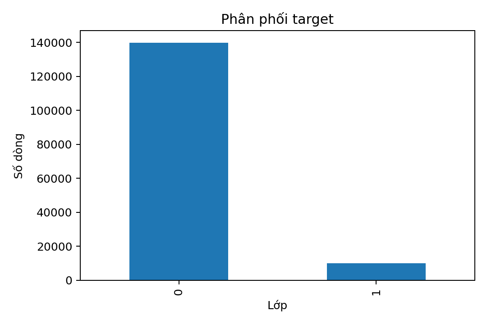

*Hình 1. Phân phối target trong Give Me Some Credit.*

Tỷ lệ positive chỉ khoảng 6.7%. Đây là lý do bài ưu tiên precision, recall, F2 và PR-AUC hơn accuracy.

### 3.3.2. Missing values

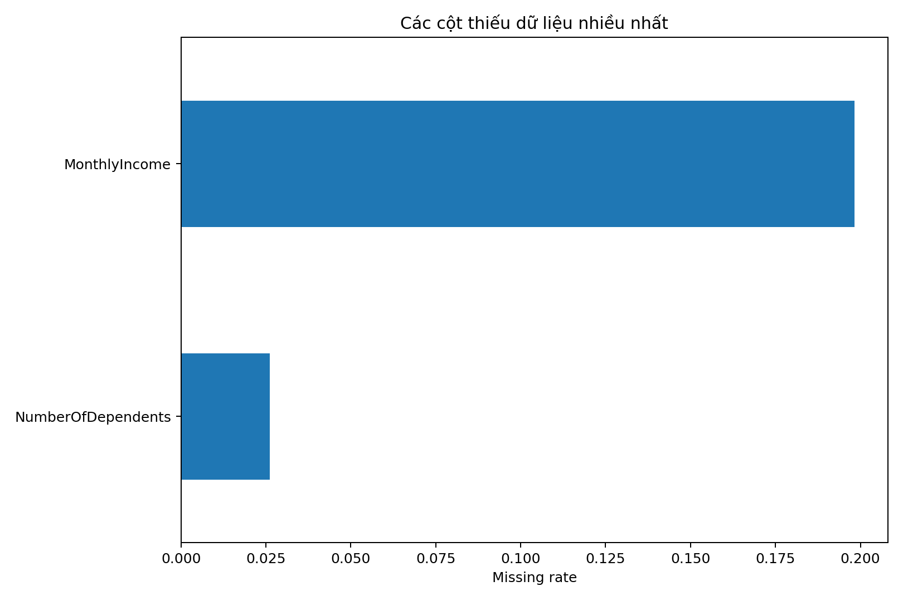

*Hình 2. Tỷ lệ missing values của các biến có dữ liệu thiếu.*

| Cột | Missing rate |
|---|---:|
| `MonthlyIncome` | 0.198 |
| `NumberOfDependents` | 0.026 |

`MonthlyIncome` thiếu gần 20%, nên không nên xóa toàn bộ dòng thiếu. Pipeline dùng median imputation trên training set. Median phù hợp hơn mean trong dữ liệu tài chính vì thu nhập thường lệch phải và có outliers.

### 3.3.3. Phân phối một số feature tài chính quan trọng

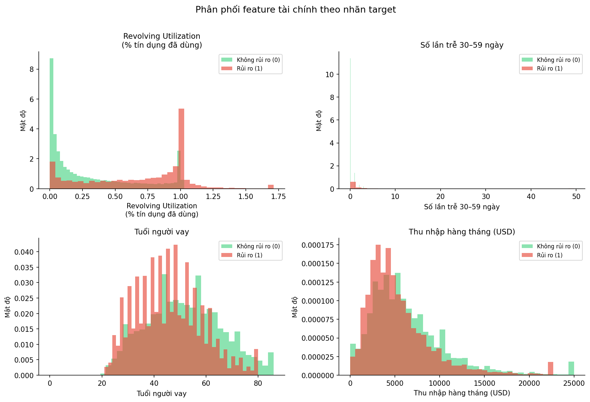

*Hình 3. Phân phối một số feature numeric chính.*

Một số feature có phân phối lệch mạnh. `MonthlyIncome` và `DebtRatio` có đuôi dài. Các biến trễ hạn có nhiều giá trị 0 và ít giá trị lớn. Đây là đặc điểm thường gặp trong dữ liệu credit-risk.

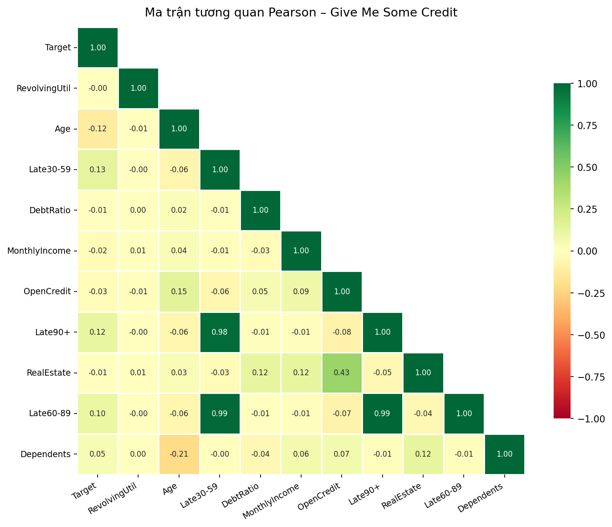

*Hình 4. Heatmap tương quan giữa các biến numeric.*

Heatmap cho thấy các biến trễ hạn có liên quan với nhau. Correlation không thay thế model, nhưng giúp giải thích vì sao lịch sử trễ hạn là nhóm biến quan trọng trong bài toán rủi ro tín dụng.

### 3.3.4. Quan hệ giữa biến trễ hạn và tỷ lệ rủi ro

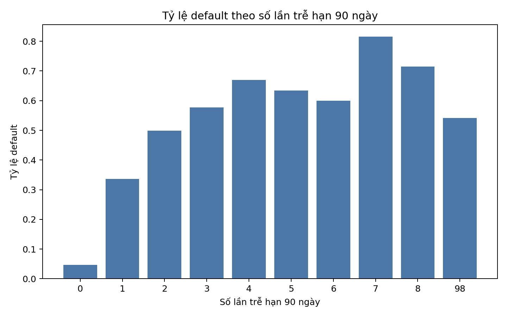

*Hình 5. Tỷ lệ class 1 theo số lần trễ hạn 90 ngày.*

Khi `NumberOfTimes90DaysLate` tăng từ 0 lên 1, tỷ lệ class `1` tăng từ khoảng 4.6% lên 33.7%. Với 2 lần trễ hạn 90 ngày, tỷ lệ này xấp xỉ 49.9%. Đây là tín hiệu nghiệp vụ mạnh, nhưng không nên dùng một biến đơn lẻ để ra quyết định vì model cần kết hợp nhiều thông tin.

## 3.4. Tiền xử lý dữ liệu Give Me Some Credit

Pipeline loại cột ID `Unnamed: 0` và tách `SeriousDlqin2yrs` khỏi feature. Đây là bước cần thiết để tránh model học từ ID hoặc target.

Dữ liệu được chia:

- Test size: 25% toàn bộ dữ liệu.
- Validation size: 20% của training split.
- Split dùng stratify theo target để giữ positive rate gần nhau.

Kết quả validation:

| Check | Value | Status |
|---|---:|---|
| `positive_rate_full` | 0.06684 | pass |
| `train_positive_rate` | 0.06684 | pass |
| `validation_positive_rate` | 0.06684 | pass |
| `test_positive_rate` | 0.06683 | pass |
| `stratified_split_close` | True | pass |

Numeric features được xử lý bằng pipeline:

1. `SimpleImputer(strategy="median")`
2. `StandardScaler()`

Imputer và scaler được fit trên phần train dùng để fit model, sau đó transform validation và test. Điều này giúp tránh leakage từ validation/test vào preprocessing.

Pipeline xuất bảng kiểm tra preprocessing:

| Check | Kết quả |
|---|---|
| Target excluded from features | pass |
| ID column excluded | pass |
| No NaN train after preprocess | pass |
| No NaN validation after preprocess | pass |
| No NaN test after preprocess | pass |
| Train matrix shape | `(90000, 10)` |
| Validation matrix shape | `(22500, 10)` |
| Test matrix shape | `(37500, 10)` |

Điểm quan trọng: test set giữ nguyên phân phối thật. Nếu undersample test set, precision và recall sẽ không còn phản ánh tình huống triển khai.

## 3.5. Cài đặt BalanceCascade trong bài

### 3.5.1. Pseudocode

```text
Input:
    X, y
    n_stages
    adaboost_estimators

Tách index:
    minority_idx
    majority_pool

For stage in 1..n_stages:
    sample majority từ majority_pool với số lượng bằng minority
    train AdaBoost stump trên minority + sampled majority
    dự đoán majority_pool
    loại majority samples đã được dự đoán đúng

Prediction:
    lấy trung bình predict_proba từ các stage models
```

### 3.5.2. BalanceCascade simple

BalanceCascade simple dùng:

| Tham số | Giá trị |
|---|---:|
| `n_stages` | 6 |
| `adaboost_estimators` | 25 |

Trong thực nghiệm, cấu hình này quá nhạy. Nó gần như dự đoán toàn bộ test set là positive tại threshold 0.50, dẫn đến recall = 1.000 nhưng precision = 0.067.

### 3.5.3. BalanceCascade tuned

BalanceCascade tuned dùng:

| Tham số | Giá trị |
|---|---:|
| `n_stages` | 2 |
| `adaboost_estimators` | 10 |

Cấu hình này được thêm để giảm báo positive quá rộng. Đây không phải tuning rộng, mà là điều chỉnh đơn giản để BalanceCascade có kết quả hợp lý hơn trong bối cảnh credit-risk.

### 3.5.4. Diễn biến majority pool qua từng stage

BalanceCascade simple:

| Stage | Majority pool sau stage | Majority removed | Minority count |
|---:|---:|---:|---:|
| 1 | 19,038 | 64,946 | 6,016 |
| 2 | 3,898 | 15,140 | 6,016 |
| 3 | 2,128 | 1,770 | 6,016 |

BalanceCascade tuned:

| Stage | Majority pool sau stage | Majority removed | Minority count |
|---:|---:|---:|---:|
| 1 | 21,319 | 62,665 | 6,016 |
| 2 | 3,531 | 17,788 | 6,016 |

Các bảng này cho thấy cơ chế cascade thật sự xảy ra: majority pool giảm mạnh sau từng stage. Đây cũng là lý do cần cẩn thận, vì nếu stage đầu quá nhạy, phần majority còn lại có thể bị thay đổi mạnh.

## 3.6. Phương pháp đánh giá

Confusion matrix giúp đọc số lượng lỗi thật:

| Ký hiệu | Ý nghĩa trong bài |
|---|---|
| TP | Khách hàng class `1` và model dự đoán `1` |
| FP | Khách hàng class `0` nhưng model dự đoán `1` |
| FN | Khách hàng class `1` nhưng model dự đoán `0` |
| TN | Khách hàng class `0` và model dự đoán `0` |

False negative nghĩa là bỏ sót khách hàng rủi ro. False positive nghĩa là cảnh báo nhầm khách hàng không thuộc nhóm rủi ro.

Bài dùng F2 để ưu tiên recall hơn precision. Tuy nhiên, nếu precision quá thấp, mô hình sẽ tạo quá nhiều cảnh báo nhầm. Vì vậy, mọi kết quả F2 đều được đọc cùng confusion matrix.

ROC-AUC đo khả năng ranking tổng thể. PR-AUC tập trung hơn vào positive class. Với dữ liệu mất cân bằng, Saito và Rehmsmeier (2015) cho rằng precision-recall plot thường cung cấp thông tin trực tiếp hơn ROC plot. Trong bài này, ROC-AUC vẫn được ghi nhận, nhưng PR-AUC và F2 được dùng nhiều hơn khi phân tích.

Pipeline sweep threshold từ 0.05 đến 0.95 trên validation set. Sau đó chọn threshold tốt nhất theo F1 hoặc F2, rồi đánh giá lại trên test set. Bài ưu tiên bảng chọn theo F2 vì mục tiêu sàng lọc cần recall cao hơn.

# CHƯƠNG 4. THỰC NGHIỆM VÀ PHÂN TÍCH KẾT QUẢ

## 4.1. Mạch trình bày kết quả

Phần kết quả được trình bày theo mạch:

```text
Case thuận lợi có kiểm soát -> Case khó/giới hạn -> Give Me Some Credit
```

Lý do là nếu trình bày ngay dataset thật, người đọc dễ chỉ thấy metric không quá đẹp mà chưa hiểu thuật toán đang cố làm gì. Vì vậy, báo cáo đi từ một case thuận lợi để thấy BalanceCascade có thể bắt minority class tốt, sau đó dùng case khó để thấy rủi ro precision thấp, cuối cùng áp dụng vào bài toán credit-risk thật.

Ba lớp thực nghiệm gồm:

1. `ideal_separable`: case thuận lợi có kiểm soát, hai lớp tương đối dễ tách.
2. `weak_overlap` và `BalanceCascade_simple`: case khó/giới hạn, dùng để thấy rủi ro false positive và báo positive quá rộng.
3. Give Me Some Credit: dataset thật, imbalance mạnh và có noise thực tế.

Case mô phỏng được tạo bằng `make_classification`. Mục tiêu không phải tạo dữ liệu đẹp để model thắng, mà để quan sát hành vi thuật toán trong môi trường có kiểm soát.

## 4.2. Case thuận lợi có kiểm soát: `ideal_separable`

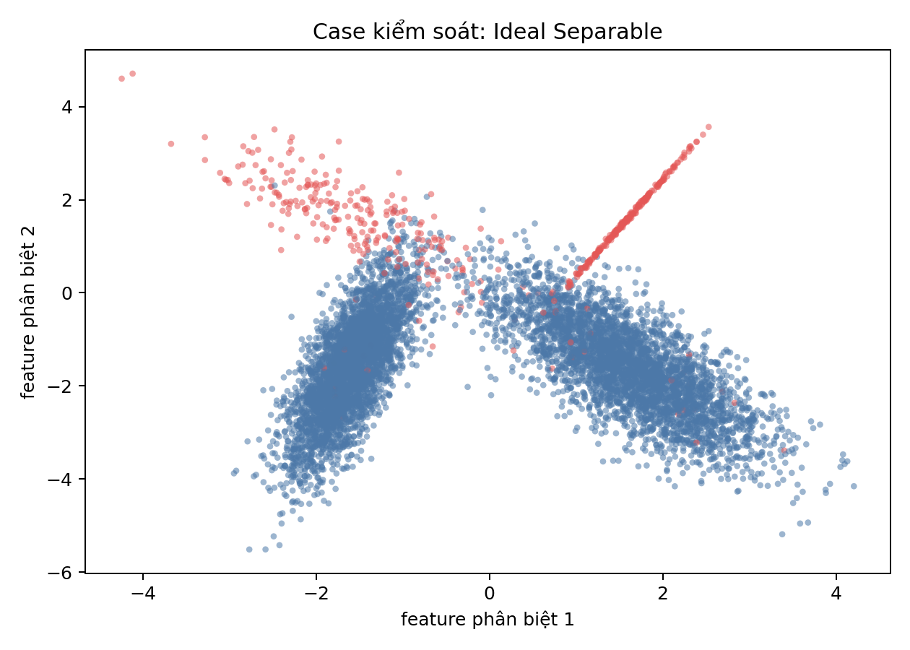

*Hình 6. Scatter plot của controlled ideal separable case.*

`ideal_separable` là dataset mô phỏng có class separation cao hơn và noise thấp hơn. Đây là case thuận lợi: nếu thuật toán không hoạt động tốt ở đây, rất khó kỳ vọng nó hoạt động tốt trên dữ liệu thật.

| Model | Precision | Recall | F2 | PR-AUC |
|---|---:|---:|---:|---:|
| RandomForest balanced | 0.938 | 0.791 | 0.816 | 0.903 |
| Logistic Regression balanced | 0.509 | 0.908 | 0.785 | 0.882 |
| EasyEnsemble | 0.612 | 0.908 | 0.828 | 0.866 |
| BalanceCascade tuned | 0.250 | 0.908 | 0.595 | 0.856 |
| BalanceCascade simple | 0.184 | 0.863 | 0.497 | 0.834 |

Trong case thuận lợi này, BalanceCascade tuned đạt recall = 0.908, nghĩa là bắt được phần lớn minority class. Tuy nhiên, precision chỉ đạt 0.250, thấp hơn các mô hình đối chiếu. Kết quả này cho thấy BalanceCascade có thể đẩy recall lên cao khi dữ liệu thuận lợi, nhưng không tự động tối ưu precision.

Vì vậy, không nên kết luận rằng BalanceCascade thắng case thuận lợi. Cách đọc đúng là: thuật toán hỗ trợ hướng recall-oriented, nhưng trade-off precision vẫn tồn tại.

## 4.3. Case khó: `weak_overlap` và báo positive quá rộng

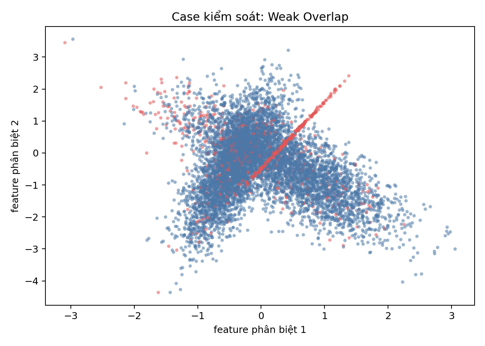

*Hình 7. Scatter plot của case weak_overlap có kiểm soát.*

`weak_overlap` là dataset mô phỏng khó hơn. Hai lớp chồng lấn nhiều và noise cao hơn, nên model khó phân biệt minority với majority.

| Model | Precision | Recall | F2 | PR-AUC |
|---|---:|---:|---:|---:|
| RandomForest balanced | 0.768 | 0.188 | 0.221 | 0.350 |
| EasyEnsemble | 0.176 | 0.463 | 0.349 | 0.259 |
| BalanceCascade simple | 0.108 | 0.664 | 0.327 | 0.150 |
| Logistic Regression balanced | 0.137 | 0.576 | 0.351 | 0.143 |
| BalanceCascade tuned | 0.105 | 0.738 | 0.335 | 0.136 |

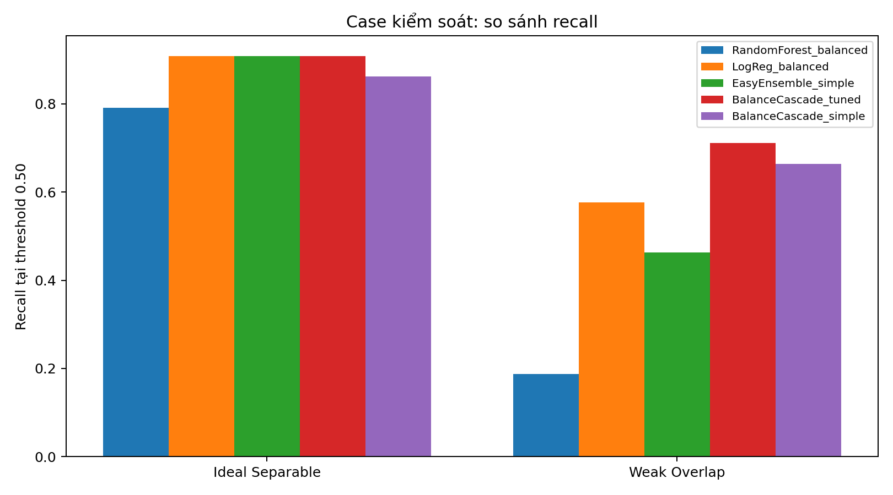

*Hình 8. So sánh recall giữa các mô hình trên case mô phỏng.*

Trong weak_overlap case, BalanceCascade tuned đạt recall cao nhất, nhưng precision chỉ 0.105. Kết quả này đúng với trực giác: khi hai lớp chồng lấn mạnh, BalanceCascade có thể bắt nhiều minority hơn, nhưng đổi lại gắn nhầm nhiều majority thành positive.

Trên chính Give Me Some Credit, BalanceCascade simple cũng là ví dụ báo positive quá rộng:

| Threshold | Precision | Recall | F2 | Cách đọc |
|---:|---:|---:|---:|---|
| 0.50 | 0.067 | 1.000 | 0.264 | Gần như dự đoán quá nhiều người là positive |
| 0.55 | 0.102 | 0.798 | 0.338 | Recall vẫn cao nhưng false positive nhiều |

Phần case khó giúp tránh hiểu sai rằng recall cao là đủ. Nếu precision quá thấp, mô hình tạo quá nhiều cảnh báo nhầm và khó dùng thực tế.

## 4.4. Dataset thật: Give Me Some Credit

Đây là phần chính của báo cáo. Give Me Some Credit là dataset thật, có positive rate chỉ khoảng 6.7%, có missing values và các feature tài chính dễ giải thích. Validation và test vẫn giữ phân phối thật, không bị undersample.

### 4.4.1. Kết quả tại threshold 0.50

| Model | Precision | Recall | F1 | F2 | Balanced accuracy | ROC-AUC | PR-AUC |
|---|---:|---:|---:|---:|---:|---:|---:|
| EasyEnsemble | 0.191 | 0.766 | 0.306 | 0.478 | 0.767 | 0.855 | 0.368 |
| RandomForest balanced | 0.579 | 0.156 | 0.246 | 0.183 | 0.574 | 0.843 | 0.355 |
| BalanceCascade tuned | 0.226 | 0.682 | 0.340 | 0.486 | 0.757 | 0.832 | 0.340 |
| Logistic Regression balanced | 0.176 | 0.668 | 0.279 | 0.429 | 0.722 | 0.799 | 0.320 |
| BalanceCascade simple | 0.067 | 1.000 | 0.125 | 0.264 | 0.500 | 0.759 | 0.320 |

Tại threshold 0.50, BalanceCascade tuned có F2 cao nhất trong bảng seed chính, nhưng EasyEnsemble có PR-AUC cao nhất. RandomForest có precision cao nhất nhưng recall thấp. BalanceCascade simple có recall = 1.000 nhưng precision quá thấp, nên không phải mô hình dùng được.

Điểm quan trọng là metric trên dataset thật không đẹp như case thuận lợi. Đây là điều hợp lý vì hai lớp trong credit-risk không tách hoàn toàn. Một khách hàng class `0` và một khách hàng class `1` có thể có feature khá giống nhau, nên model phải đánh đổi giữa recall và precision.

### 4.4.2. Kết quả sau khi chọn threshold trên validation

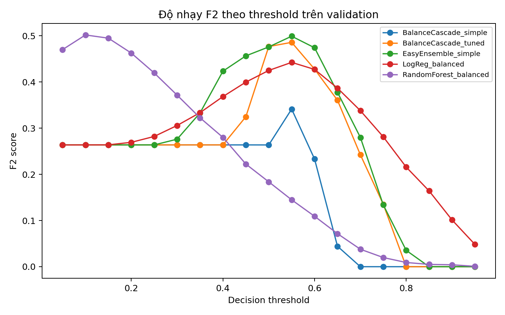

*Hình 9. Độ nhạy F2 theo decision threshold trên validation.*

| Model | Threshold | Precision | Recall | F2 | Predicted positive rate |
|---|---:|---:|---:|---:|---:|
| EasyEnsemble | 0.55 | 0.322 | 0.593 | 0.508 | 0.123 |
| RandomForest balanced | 0.10 | 0.248 | 0.673 | 0.501 | 0.181 |
| BalanceCascade tuned | 0.55 | 0.257 | 0.640 | 0.493 | 0.166 |
| Logistic Regression balanced | 0.55 | 0.246 | 0.557 | 0.445 | 0.151 |
| BalanceCascade simple | 0.55 | 0.102 | 0.798 | 0.338 | 0.521 |

Sau khi chọn threshold theo F2 trên validation, EasyEnsemble và RandomForest balanced nhỉnh hơn BalanceCascade tuned. Khoảng cách giữa EasyEnsemble và BalanceCascade tuned không quá lớn, nhưng đủ để không nên nói BalanceCascade là mô hình tốt nhất.

Điều này làm kết luận thực tế hơn: BalanceCascade tuned cạnh tranh và đúng trọng tâm bài vì minh họa cascade undersampling, nhưng không thắng tuyệt đối mọi mô hình đối chiếu.

### 4.4.3. Precision-recall curve và ROC curve

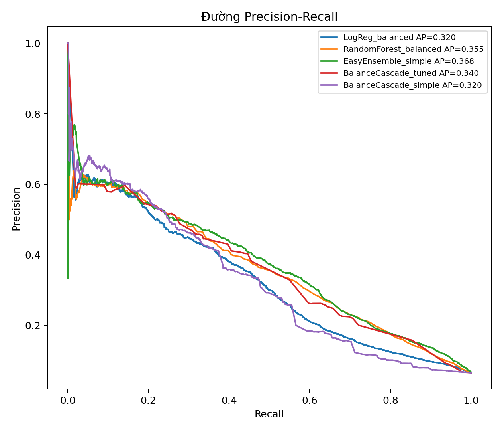

*Hình 10. Precision-recall curve trên Give Me Some Credit.*

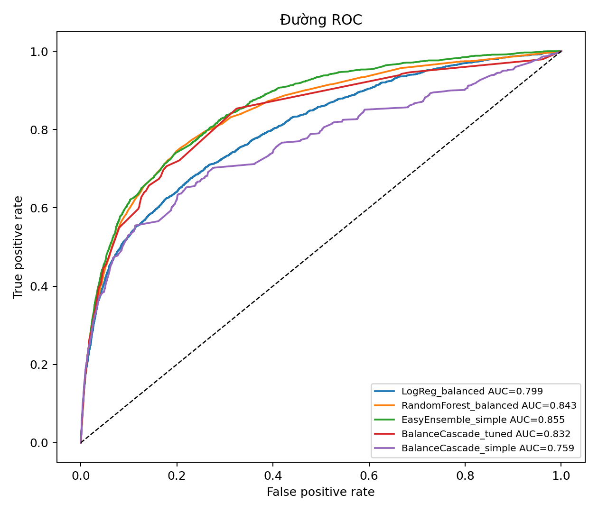

*Hình 11. ROC curve trên Give Me Some Credit.*

PR curve cho thấy EasyEnsemble có đường cong tốt trong phần lớn vùng recall. RandomForest có ranking ổn, nhưng cần hạ threshold để tăng recall. BalanceCascade tuned có trade-off khá tốt ở seed chính, nhưng không vượt EasyEnsemble về PR-AUC.

Vì positive rate chỉ 6.7%, precision tuyệt đối nhìn thấp là bình thường. Ví dụ, precision 0.257 nghĩa là trong nhóm được gắn cờ, tỷ lệ class `1` cao hơn khoảng 3.8 lần so với chọn ngẫu nhiên. Tuy vậy, precision này vẫn phù hợp hơn với sàng lọc, chưa đủ để ra quyết định tự động.

### 4.4.4. Confusion matrix của các mô hình

Logistic Regression balanced:

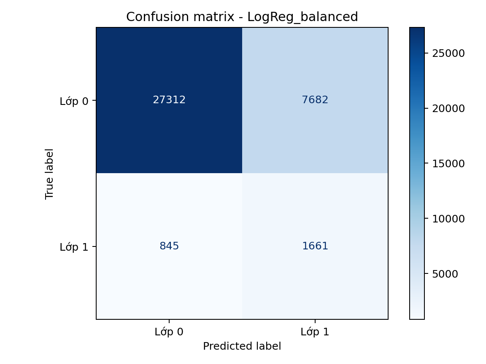

RandomForest balanced:

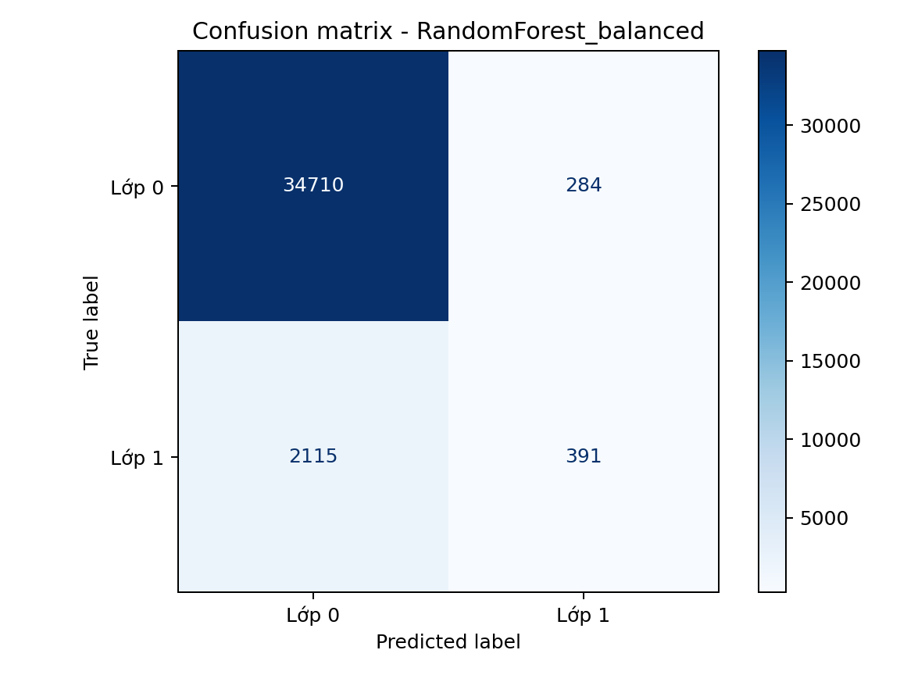

EasyEnsemble:

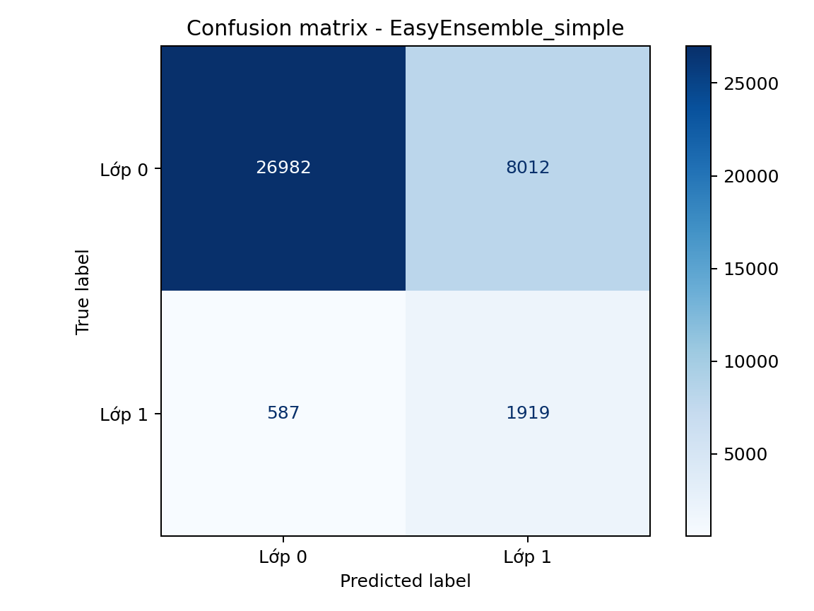

BalanceCascade simple:

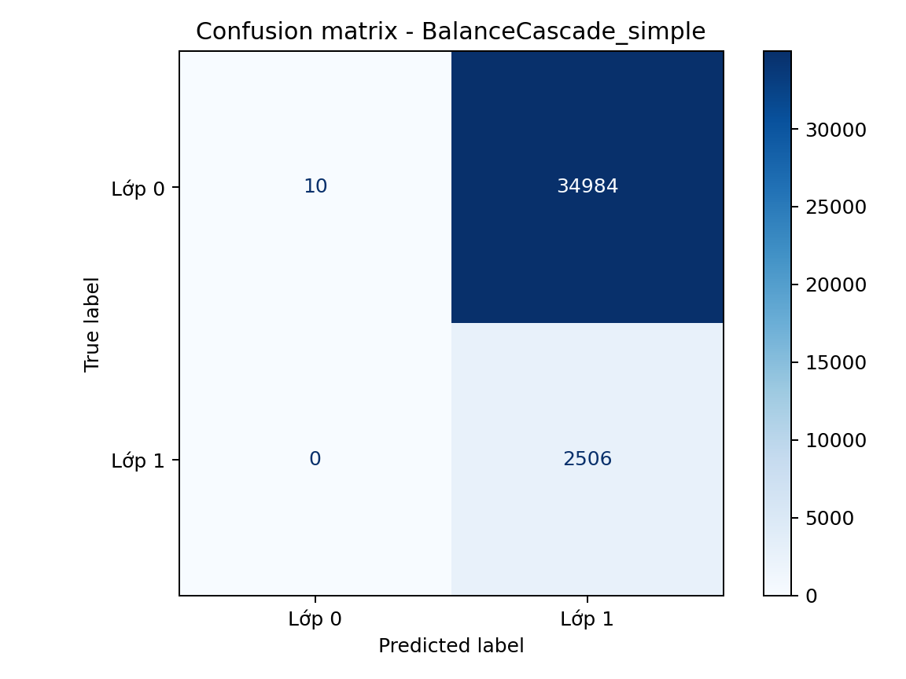

BalanceCascade tuned:

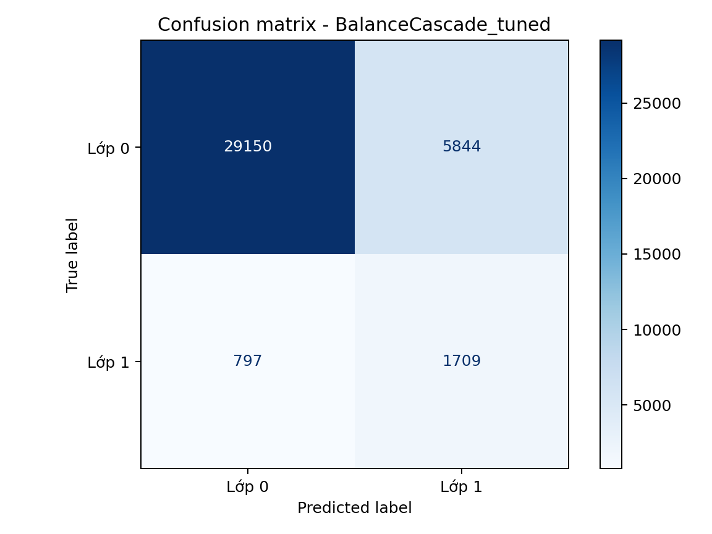

*Hình 12-16. Confusion matrix của các mô hình tại threshold 0.50.*

| Model | TN | FP | FN | TP |
|---|---:|---:|---:|---:|
| Logistic Regression balanced | 27,173 | 7,821 | 833 | 1,673 |
| RandomForest balanced | 34,710 | 284 | 2,115 | 391 |
| EasyEnsemble | 26,862 | 8,132 | 586 | 1,920 |
| BalanceCascade simple | 10 | 34,984 | 0 | 2,506 |
| BalanceCascade tuned | 29,150 | 5,844 | 797 | 1,709 |

BalanceCascade simple gần như dự đoán toàn bộ test set là positive. Nó không bỏ sót positive nào, nhưng tạo 34,984 false positives. BalanceCascade tuned giảm false positives xuống 5,844 và vẫn phát hiện 1,709 trong 2,506 positive cases. Đây là trade-off hợp lý hơn.

## 4.5. So sánh các mô hình

BalanceCascade simple minh họa rõ rủi ro khi cấu hình quá mạnh. Recall = 1.000 nhìn có vẻ tốt, nhưng precision = 0.067 nghĩa là gần như chỉ bằng positive rate gốc. Nói cách khác, model gần như không lọc được gì tại threshold 0.50.

BalanceCascade tuned giảm số stage và số AdaBoost estimators. Kết quả tại threshold 0.50 cân bằng hơn: precision = 0.226, recall = 0.682, F2 = 0.486. Khi chọn threshold 0.55 trên validation, F2 test tăng lên 0.493.

Điểm mạnh của tuned là giữ recall khá cao nhưng không dự đoán toàn bộ test set là positive. Điểm yếu là PR-AUC và kiểm tra nhiều seed vẫn kém hơn EasyEnsemble.

Logistic Regression balanced đơn giản nhưng khá ổn. Tại threshold 0.50, recall = 0.668 và F2 = 0.429. Sau threshold tuning theo F2, F2 test = 0.445. Đây là mô hình đối chiếu tốt để chứng minh rằng phương pháp phức tạp hơn phải có lý do rõ ràng, không chỉ vì tên thuật toán nghe mạnh.

RandomForest balanced có precision cao tại threshold 0.50 nhưng recall thấp. Khi hạ threshold xuống 0.10, F2 test đạt 0.501. EasyEnsemble đạt F2 test = 0.508 và PR-AUC cao nhất ở seed chính. Hai kết quả này cho thấy BalanceCascade không thắng tuyệt đối.

Cách kết luận hợp lý: BalanceCascade là phương pháp chính của bài và có ích để học class imbalance theo hướng cascade undersampling, nhưng trong dataset này EasyEnsemble và RandomForest sau threshold tuning là các mô hình đối chiếu rất cạnh tranh.

## 4.6. Kiểm tra độ ổn định theo seed

Pipeline chạy thêm 5 seed: 11, 23, 42, 58, 91. Mỗi seed đều lặp lại đúng quy trình: split dữ liệu, fit preprocessing trên train, chọn threshold theo F2 trên validation, rồi đánh giá test.

| Model | Threshold mean ± std | Precision mean ± std | Recall mean ± std | F2 mean ± std | PR-AUC mean ± std |
|---|---:|---:|---:|---:|---:|
| EasyEnsemble | 0.55 ± 0.00 | 0.314 ± 0.012 | 0.595 ± 0.013 | 0.505 ± 0.007 | 0.367 ± 0.005 |
| RandomForest balanced | 0.10 ± 0.00 | 0.252 ± 0.003 | 0.668 ± 0.010 | 0.502 ± 0.006 | 0.352 ± 0.006 |
| BalanceCascade tuned | 0.52 ± 0.03 | 0.239 ± 0.019 | 0.638 ± 0.061 | 0.476 ± 0.020 | 0.313 ± 0.023 |
| Logistic Regression balanced | 0.55 ± 0.04 | 0.248 ± 0.049 | 0.548 ± 0.064 | 0.433 ± 0.010 | 0.313 ± 0.006 |
| BalanceCascade simple | 0.55 ± 0.00 | 0.108 ± 0.009 | 0.808 ± 0.036 | 0.351 ± 0.017 | 0.334 ± 0.014 |

Kết quả nhiều seed làm kết luận chắc hơn. EasyEnsemble và RandomForest ổn định nhất theo F2. BalanceCascade tuned vẫn giữ recall khá cao, nhưng dao động nhiều hơn. BalanceCascade simple có recall cao, nhưng precision thấp, nên phù hợp để minh họa rủi ro báo positive quá rộng hơn là làm mô hình cuối.

## 4.7. Thảo luận

BalanceCascade có ích khi mục tiêu là phát hiện nhiều minority samples hơn và false negative có chi phí cao. Trong sàng lọc rủi ro, mô hình có thể dùng để gắn cờ khách hàng cần review thêm. Khi đó, recall cao có giá trị, miễn là precision không quá thấp.

Ngược lại, BalanceCascade không nên dùng trực tiếp để tự động từ chối khoản vay nếu precision chưa đủ cao. Với BalanceCascade tuned, precision khoảng 0.226 đến 0.257 tùy threshold. Con số này tốt hơn positive rate gốc, nhưng vẫn có nhiều false positives. Vì vậy, output nên là tín hiệu hỗ trợ review, không phải quyết định cuối cùng.

Nếu chọn ngẫu nhiên 100 khách hàng, kỳ vọng có khoảng 7 khách thuộc class `1`. Nếu lấy 100 khách hàng mà BalanceCascade tuned gắn cờ tại threshold 0.50, kỳ vọng có khoảng 23 khách thuộc class `1`. Như vậy mô hình giúp làm giàu nhóm cần kiểm tra, nhưng không thay thế chuyên viên tín dụng hoặc chính sách đánh giá rủi ro.

# CHƯƠNG 5. KẾT LUẬN VÀ HƯỚNG PHÁT TRIỂN

## 5.1. Tổng hợp kết quả chính

Bài đã xây dựng pipeline phân loại mất cân bằng đầy đủ: EDA, preprocessing chống leakage, BalanceCascade là thuật toán chính, các mô hình so sánh, threshold tuning và kiểm tra nhiều seed. Phần kết quả được kể theo mạch controlled cases -> dataset thật để thấy cả khả năng và giới hạn của thuật toán trước khi đọc kết quả chính.

Kết quả chính:

- Give Me Some Credit có positive rate = 6.7%, nên accuracy không phù hợp.
- Trong case thuận lợi `ideal_separable`, BalanceCascade tuned đạt recall = 0.908 nhưng precision chỉ 0.250.
- Trong case khó `weak_overlap`, BalanceCascade tuned đạt recall = 0.738 nhưng precision chỉ 0.105, cho thấy rủi ro báo positive quá rộng.
- Trên Give Me Some Credit tại threshold 0.50, BalanceCascade tuned đạt precision = 0.226, recall = 0.682 và F2 = 0.486.
- Sau threshold tuning theo F2, BalanceCascade tuned đạt F2 = 0.493 trên test.
- EasyEnsemble đạt F2 = 0.508 và RandomForest balanced đạt F2 = 0.501 sau threshold tuning.
- Kiểm tra nhiều seed cho thấy EasyEnsemble và RandomForest ổn định hơn BalanceCascade tuned.

Kết luận cuối: BalanceCascade có vai trò rõ trong bài toán sàng lọc rủi ro, nhưng cần tuning và không nên kết luận là mô hình tốt nhất tuyệt đối.

## 5.2. Hạn chế của nghiên cứu

Về dataset, Give Me Some Credit là dataset cũ từ Kaggle. Dữ liệu phù hợp cho học thuật, nhưng thiếu ngữ cảnh triển khai thật như chính sách cho vay, chi phí serious delinquency, chi phí review hồ sơ và fairness constraints.

Về implementation, BalanceCascade trong bài là bản đơn giản, giữ ý tưởng chính của thuật toán. Code chưa tái hiện đầy đủ các chi tiết trong paper gốc, đặc biệt là cơ chế điều khiển false-positive rate nội bộ ở từng stage.

Về cách đánh giá, bài dùng repeated holdout theo nhiều seed, chưa dùng stratified cross-validation nhiều fold. Ngoài ra, F2 chỉ phản ánh ưu tiên recall theo một trọng số cố định. Trong thực tế, nên có cost matrix rõ cho false positive và false negative.

## 5.3. Hướng phát triển

Có thể dùng stratified cross-validation nhiều fold để ước lượng độ dao động chắc hơn so với vài lần holdout.

Nếu biết chi phí bỏ sót khách hàng rủi ro và chi phí cảnh báo nhầm, có thể chọn threshold theo expected cost thay vì F2.

Một hướng khác là so sánh với Balanced Random Forest, RUSBoost hoặc SMOTE-based methods. Các phương pháp này là mô hình đối chiếu tự nhiên cho bài toán imbalanced classification. Tuy nhiên, chỉ nên thêm nếu có đủ thời gian phân tích, tránh làm bài bị loãng.

Cuối cùng, feature importance hoặc permutation importance có thể giúp giải thích biến nào đóng góp nhiều cho cảnh báo rủi ro. Phần này hữu ích nếu muốn chuyển từ bài thuật toán sang bài có diễn giải nghiệp vụ sâu hơn.

## Tài liệu tham khảo

He, H., & Garcia, E. A. (2009). Learning from imbalanced data. *IEEE Transactions on Knowledge and Data Engineering, 21*(9), 1263-1284. https://doi.org/10.1109/TKDE.2008.239

Kaggle. (2011). *Give Me Some Credit*. https://www.kaggle.com/c/GiveMeSomeCredit/data

Krawczyk, B. (2016). Learning from imbalanced data: Open challenges and future directions. *Progress in Artificial Intelligence, 5*, 221-232. https://doi.org/10.1007/s13748-016-0094-0

Liu, X.-Y., Wu, J., & Zhou, Z.-H. (2009). Exploratory undersampling for class-imbalance learning. *IEEE Transactions on Systems, Man, and Cybernetics, Part B (Cybernetics), 39*(2), 539-550. https://doi.org/10.1109/TSMCB.2008.2007853

Saito, T., & Rehmsmeier, M. (2015). The precision-recall plot is more informative than the ROC plot when evaluating binary classifiers on imbalanced datasets. *PLOS ONE, 10*(3), Article e0118432. https://doi.org/10.1371/journal.pone.0118432

scikit-learn developers. (n.d.-a). *LogisticRegression*. Retrieved May 31, 2026, from https://scikit-learn.org/stable/modules/generated/sklearn.linear_model.LogisticRegression.html

scikit-learn developers. (n.d.-b). *RandomForestClassifier*. Retrieved May 31, 2026, from https://scikit-learn.org/stable/modules/generated/sklearn.ensemble.RandomForestClassifier.html

scikit-learn developers. (n.d.-c). *make_classification*. Retrieved May 31, 2026, from https://scikit-learn.org/stable/modules/generated/sklearn.datasets.make_classification.html
